# FaceQuest

FaceQuest is a Python-based application that helps users find images of the same person from a large dataset of images stored in a folder named `dataset`. The project is designed to work through a Telegram bot, allowing users to interact with the system, upload images, and manage their searches conveniently.

## Features

- **Image Search:** Users can search for images of a person from the `dataset` folder.
- **Image Verification:** The bot verifies whether the image the user is searching for is their own by asking them to send a selfie with two fingers up.
- **Database Storage:** All found images are stored in a database for easy retrieval during future searches.
- **Multiple Users:** The system can handle multiple users at the same time, ensuring a smooth experience for everyone.
- **Automatic Recognition:** If a user searches for the same person again, the bot will automatically ask if it's the same person from a previous search. If confirmed, it will retrieve the images from the database.
- **Image Upload:** Users can upload multiple images to the `dataset` folder, including images in document form, via the Telegram bot.

## Getting Started

### Prerequisites

- Python 3.8+
- A Telegram bot token (you can get this by creating a bot through the [BotFather](https://core.telegram.org/bots#botfather) on Telegram)

### Installation

1. **Clone the Repository**

   ```bash
   git clone https://github.com/your-username/facequest.git
   cd facequest

2. **Set Up the Virtual Environment**

Create and activate a virtual environment:

    python -m venv venv 

    venv\Scripts\activate

3. **Install Dependencies**

Install the required Python packages using the requirements.txt file:


    pip install -r requirements.txt


4. **You might encounter dlib error**

## Screenshots

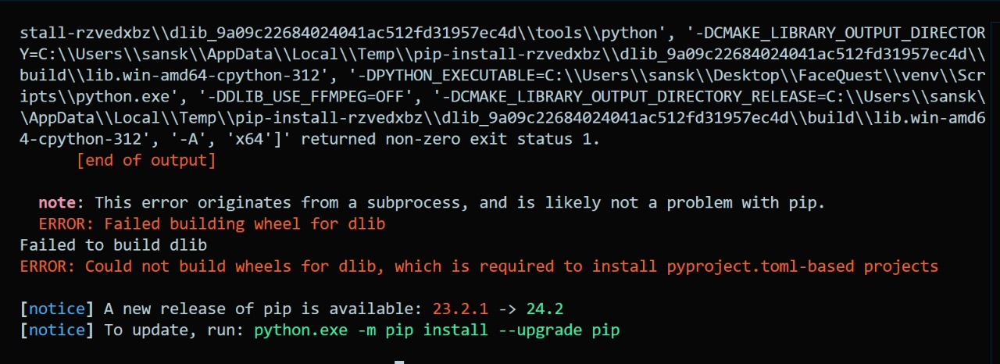

**You Just Need To Install Dlib Manually**

 **Clone the Repository**

    git clone https://github.com/z-mahmud22/Dlib_Windows_Python3.x.git

Copy that required dlib.whl file in the FaceQuest folder and then install dlib According to your python version. In my case, it's 3.12  so install this one 

    python -m pip install dlib-19.24.99-cp312-cp312-win_amd64.whl

and run this command again to make sure everything installed Correctly

    pip install -r requirements.txt

    pip install git+https://github.com/ageitgey/face_recognition_models

**Now you need to run two python file Separately in different terminals**

This one handle Telegram Bot

**Don't forget to put your Telegram Bot token in config.py**

    python app.py

and this one handle Image Recognition **Before running this you should put all your photos in dataset folder and set the already_added_images (no of images you added in the dataset folder Manually ) in handlers.py**

    python Image_Recognition.py

**When you run this file, it starts encoding face images You need to wait until it say Saving encoding**
## Save encoding

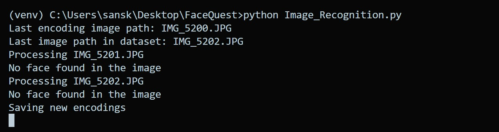


**Your Folder structure should look like this**

## Screenshots

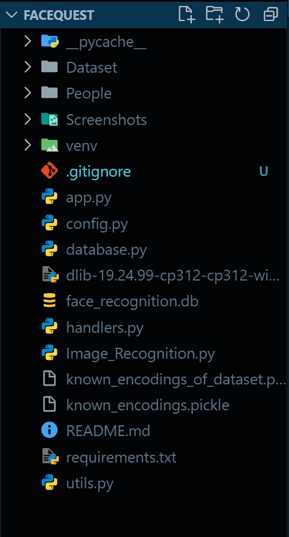

Cheers! If you did everything right then it's time to enjoy

Give it a ⭐ star if you really like it

## Screenshots of demo

1. 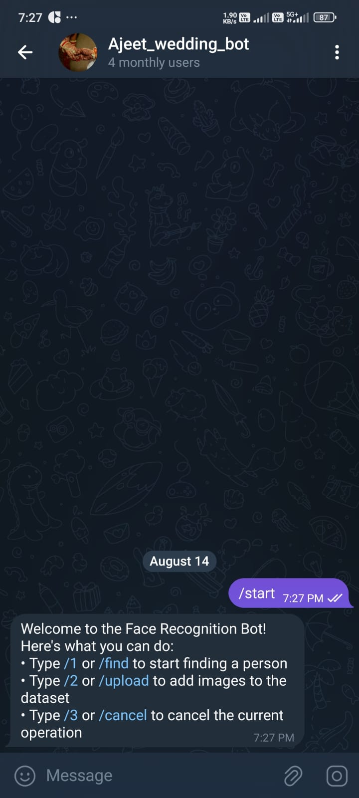

2. 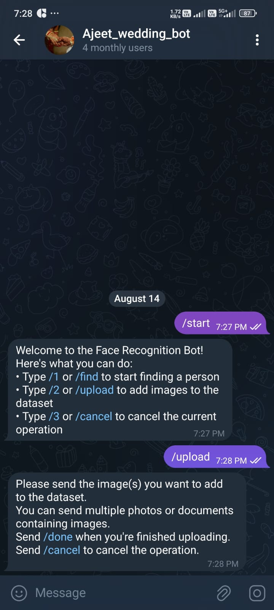

3. 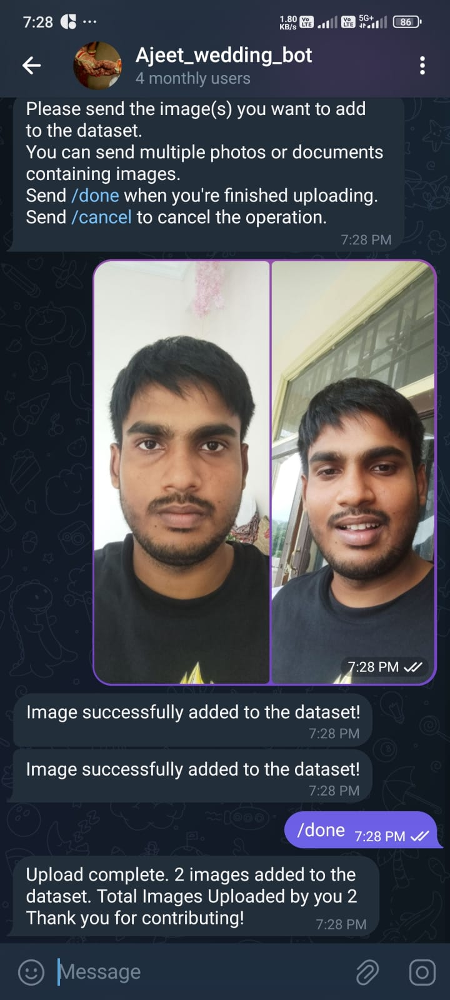

4. 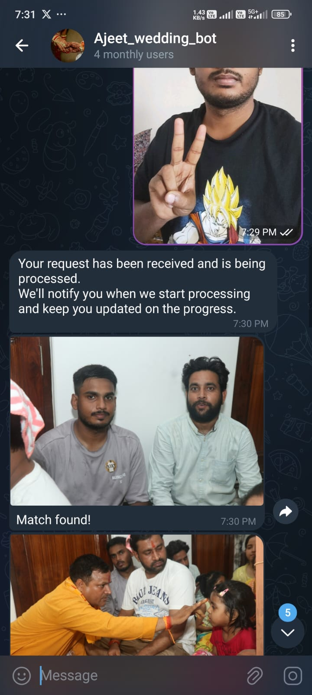

5. 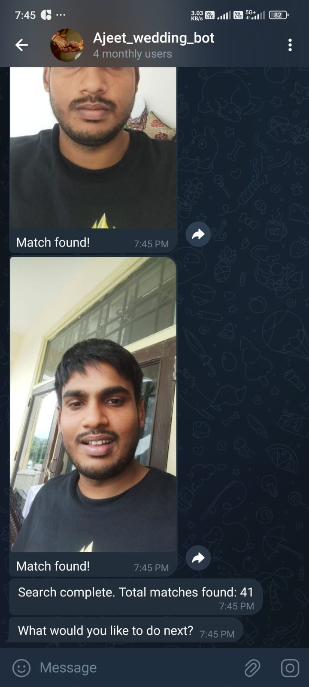

6. 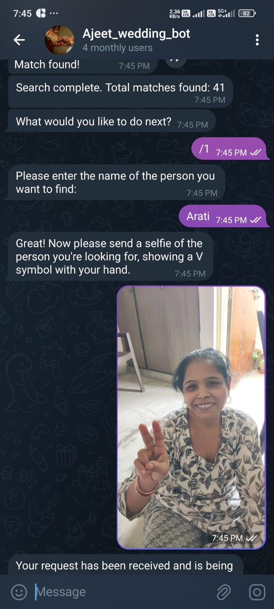

7. 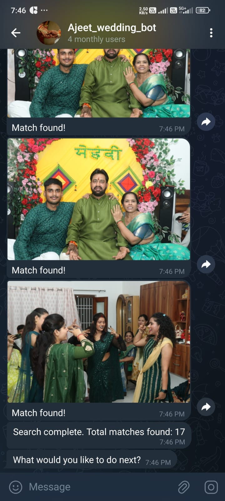

8. 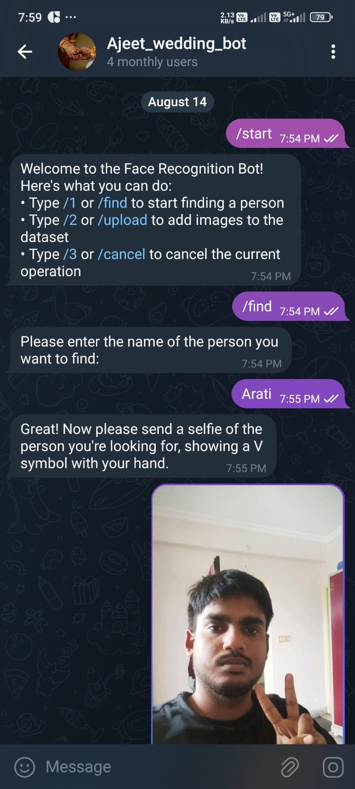

9. 


**Usage**

1. Search Images: Send a photo to the bot to search for similar images in the dataset folder.

2. Image Verification: When prompted, send a selfie with two fingers up to verify your identity.

3. Upload Images: Use the bot to upload multiple images or documents containing images to the dataset folder.

4. Retrieve Previous Searches: If you search for the same person again, the bot will recognize the previous search and ask if it's the same person. If confirmed, it will retrieve the images from the database.

## Contributing

Contributions are welcome! Please fork the repository and submit a pull request.

Please adhere to this project's `code of conduct`.

## License

This project is licensed under the MIT License - see the LICENSE file for details.

## Contact

For any inquiries or support, please reach out to Samskar362002@gmail.com.